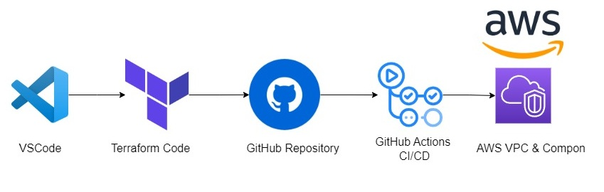

# Create and Manage Infrastructure Using Terraform and Automate the Deployment Process with GitHub Actions

## Overview


This repository provides a comprehensive guide and example implementation for creating and managing infrastructure using Terraform and automating the deployment process with GitHub Actions. The goal is to streamline infrastructure provisioning and application deployment, ensuring a consistent and repeatable process.

## Table of Contents

- [Features](#features)
- [Prerequisites](#prerequisites)
- [Getting Started](#getting-started)
- [GitHub Actions Workflow](#github-actions-workflow)
- [Terraform Configuration](#terraform-configuration)
- [License](#license)

## Features

- Infrastructure as Code (IaC) using Terraform
- Automated deployment process with GitHub Actions
- Modular Terraform configurations for reusability
- Example workflows for CI/CD pipelines
- Easy to customize and extend for various cloud providers

## Prerequisites

Before you begin, ensure you have the following installed:

- Terraform
- Git
- A GitHub account
- Access to a cloud provider (e.g., AWS, Azure, GCP) with appropriate permissions


## Getting Started
1. **Clone the repository:**

   ```bash
   git clone https://github.com/aa-cloudengineer/vpc-terra-github-action.git
   cd vpc-terra-github-action

2. **Set up your cloud provider credentials:**
Follow the documentation for your specific cloud provider to configure authentication. For example, for AWS, you can set up your credentials using the AWS CLI. 

3. **Initialize Terraform:**
Run the following command to initialize the Terraform configuration:
   ```bash
   terraform init

4. **Plan your infrastructure:**
Generate an execution plan to see what resources will be created:
   ```bash
   terraform plan
   
6. **Apply the configuration:**
Deploy the infrastructure by applying the configuration:
   ```bash
   terraform Apply 
   
## GitHub Actions Workflow

The GitHub Actions workflow is defined in the .github/workflows/ directory. It automates the following steps:

1. Trigger on push or pull request events.
2. Set up the environment.
3. Run Terraform commands to plan and apply changes.

## Terraform Configuration    
The Terraform configuration files are located in the terraform/ directory. You can customize these files to define your infrastructure resources, such as virtual machines, networks, and databases.

##  License

This project is licensed under the MIT License. See the LICENSE file for details.
   
   
   
